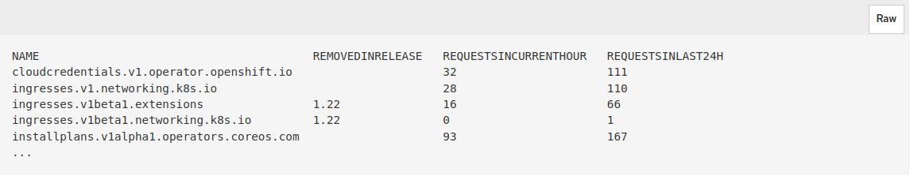
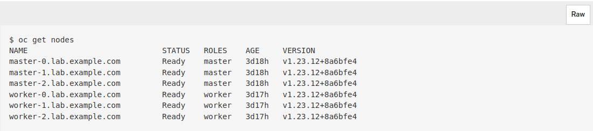
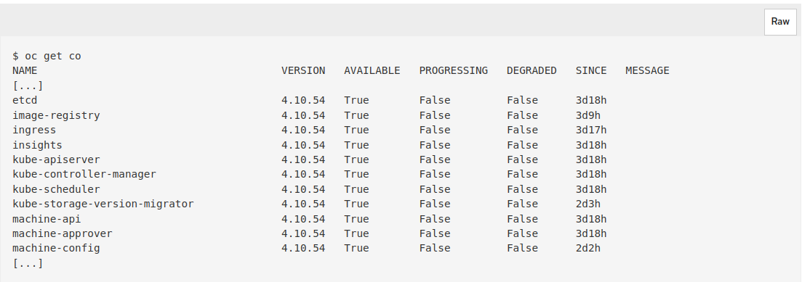
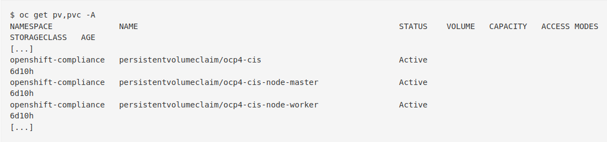
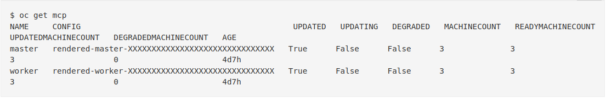

# OpenShift Upgrades

Stakater will perform one major OpenShift version upgrade per day per cluster.

Upgrades of test and staging clusters will typically be done first before production clusters.

The time it takes to upgrade the cluster depends on the number of nodes present on the cluster, typically ranging from 2 to 3 hours if no issues arise. However, in case any issues occur, the upgrade process may extend up to 6 hours.

The estimated times assume Stakater has cluster-admin access to the clusters.

Physical presence will only be required if any on-prem machines need to be restarted.

## Pre-Upgrade Steps

### Removed Kubernetes APIs

You can use the APIRequestCount API to track API requests and review whether any of them are using one of the removed APIs. We will need to migrate the API that will be removed in the next release.

Run the following command and examine the REMOVEDINRELEASE column of the output to identify APIs that will be removed in a future release but are currently in use and share its output with Stakater.

```sh
oc get apirequestcount
```



### Checking the Cluster Objects

1. Confirm that no critical alerts exist on the cluster. Check the firing alerts in Alertmanager via Web Console -> Observe -> Alerting and make sure there is no Critical alert firing, and that you are aware of the existing Info ones. Update will be blocked unless you resolve all critical alerts.

1. Verify all nodes are in the ready state.

    ```sh
    oc get nodes
    ```

    

1. Confirm that all cluster operators are in the ready state.

    ```sh
    oc get co
    ```

    

1. Check the health of PVs (Persistent Volumes) and PVCs (Persistent Volume Claims) to ensure:
    1. All PVs and PVCs are mounted
    2. None of the PVs and PVCs are unmounted
    3. None of the PVs and PVCs are stuck in the terminating state
    4. No abnormal configurations exist

    ```sh
    oc get pvc,pv -A
    ```

    

1. Verify the health of machineConfigPools:
    1. Ensure `MACHINECOUNT` equals `READYMACHINECOUNT`
    2. Ensure there are no machines stuck in `UPDATEDMACHINECOUNT` or `DEGRADEDMACHINECOUNT`

    ```sh
    oc get mcp
    ```

    

1. Check the health of the etcd cluster. Visit the following link from OpenShift documentation to replace an unhealthy etcd member if any. [Replacing an unhealthy etcd member
](https://docs.openshift.com/container-platform/4.12/backup_and_restore/control_plane_backup_and_restore/replacing-unhealthy-etcd-member.html#restore-identify-unhealthy-etcd-member_replacing-unhealthy-etcd-member)

1. The Customer needs to take a backup of the etcd cluster to ensure data safety in case of any issues during the upgrade process, see the official. [`Backing up etcd` Red Hat documentation for the applicable version](https://docs.openshift.com/container-platform/4.15/backup_and_restore/control_plane_backup_and_restore/backing-up-etcd.html)

1. Check pods that are in error state on the cluster and fix those errors.

    ```sh
    oc get pods --all-namespaces | egrep -v 'Running | Completed | Succeeded'
    ```

## Upgrade Steps

1. Start the upgrade from the cluster console
1. Run the following command to acknowledge that you have completed the evaluation to deprecating APIs and your cluster is ready for the Kubernetes API removals.

    ```sh
    # For Openshift 4.11
    oc -n openshift-config patch cm admin-acks --patch '{"data":{"ack-4.11-kube-1.25-api-removals-in-4.12":"true"}}' --type=merge
    # For Openshift 4.12
    oc -n openshift-config patch cm admin-acks --patch '{"data":{"ack-4.12-kube-1.26-api-removals-in-4.13":"true"}}' --type=merge
    ```

1. From the web console, click Administration → Cluster Settings and review the contents of the Details tab.
1. Ensure that the Channel is set to the correct channel for the version that you want to update to, such as stable-4.12.
Select a version to update to, and click Update.
1. Monitor the upgrade process closely for any errors or warnings
1. If any error occurs or manual intervention is required, Stakater will address it promptly

## Post-Upgrade Steps

1. Perform all upgrade steps again to ensure the stability of the cluster
1. Verify that all nodes are in the ready state after the upgrade
1. Confirm that all cluster operators are functioning properly post-upgrade
1. Check the health of PVs and PVCs again to ensure successful migration and mounting
1. Verify the health of `machineConfigPools` and ensure the machine counts are as expected
1. Conduct tests or checks to ensure the etcd cluster is functioning correctly after the upgrade
1. Ensure all applications and services are running as expected on the upgraded cluster
1. Document any issues encountered during the upgrade process and their resolutions
1. Update the system documentation with details of the upgrade process, including any configurations or settings changed during the upgrade
1. Provide post-upgrade support to address any lingering issues or concerns
